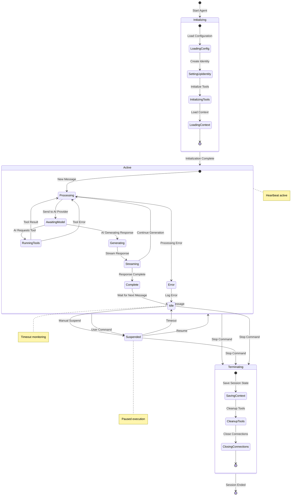
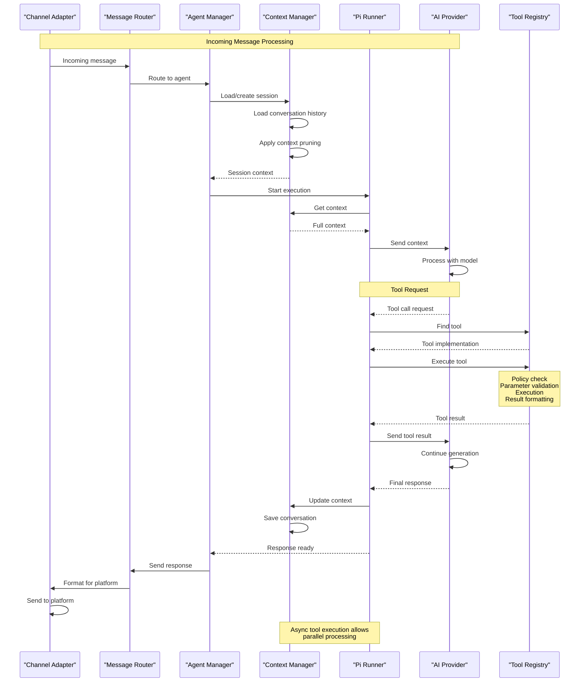
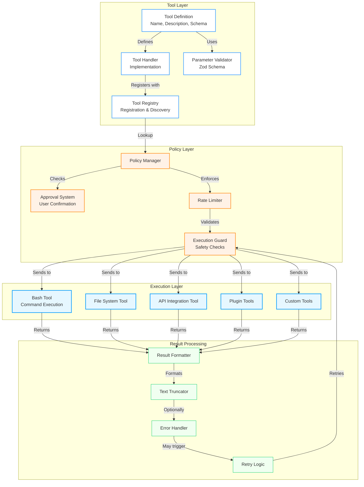
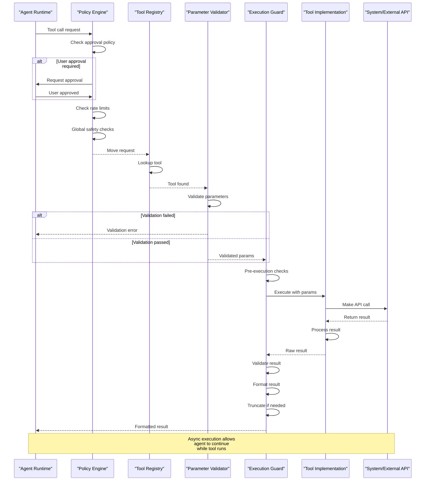
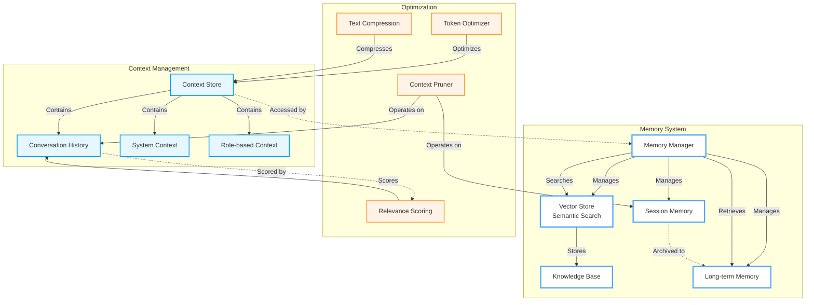
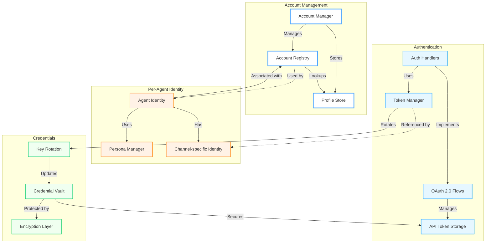

# Agent Runtime Architecture

OpenClaw's agent runtime provides a sophisticated environment for AI agent execution, built on the Pi AI framework and enhanced with OpenClaw-specific features.

## Core Components

```mermaid
graph TB
    subgraph "Agent Runtime Core"
        AgentManager["Agent Manager<br/>src/agents/agents.ts"]
        SessionManager["Session Manager<br/>src/agents/context.ts"]
        IdentityManager["Identity Manager<br/>src/agents/identity.ts"]
    end

    subgraph "Execution Engine"
        PiRunner["Pi Embedded Runner<br/>src/agents/pi-embedded-runner.ts"]
        PiSubscriber["Pi Event Subscriber<br/>src/agents/pi-embedded-subscribe.ts"]
        ToolExecutor["Tool Execution<br/>src/agents/tool-policy.ts"]
        ContextManager["Context Manager<br/>src/agents/context.ts"]
    end

    subgraph "Tool System"
        ToolRegistry["Tool Registry<br/>src/agent-tools/*.ts"]
        PolicyEngine["Policy Engine<br/>src/agents/tool-policy.ts"]
        BashExecutor["Bash Tool Executor<br/>src/agents/bash-tools.exec.ts"]
        FileTools["File System Tools"]
        APITools["API Integration Tools"]
        PluginTools["Plugin-Provided Tools"]
    end

    subgraph "Context & Memory"
        ContextStore["Context Store<br/>~/.openclaw/sessions/"]
        MemorySystem["Memory System<br/>src/agents/memory.ts"]
        Pruner["Context Pruner<br/>src/agents/context-pruner.ts"]
        HistoryManager["Conversation History"]
    end

    subgraph "Authentication"
        AuthManager["Auth Manager<br/>src/auth/"]
        CredentialStore["Credential Store"]
        TokenManager["Token Manager"]
        MultiAccount["Multi-Account Support"]
    end

    AgentManager -->|Manages| SessionManager
    AgentManager -->|Manages| IdentityManager
    AgentManager -->|Executes| PiRunner

    SessionManager -->|Maintains| PiSubscriber
    SessionManager -->|Provides| ContextManager

    PiRunner -->|Uses| ToolExecutor
    PiRunner -->|Manages| ContextManager
    PiSubscriber -->|Fetches| ContextManager

    ToolExecutor -->|Registers| ToolRegistry
    ToolExecutor -->|Validates| PolicyEngine
    ToolExecutor -->|Executes| BashExecutor

    ToolRegistry -->|Contains| FileTools
    ToolRegistry -->|Contains| APITools
    ToolRegistry -->|Contains| PluginTools

    ContextManager -->|Reads/Writes| ContextStore
    ContextManager -->|Integrates| MemorySystem
    ContextManager -->|Manages| HistoryManager
    MemorySystem -- > |Optimizes | Pruner

    AgentManager -->|Authenticates| AuthManager
    AuthManager -->|Manages| CredentialStore
    AuthManager -->|Manages| TokenManager
    AuthManager -->|Supports| MultiAccount

    %% External interactions
    AgentManager -->|Communicates with| ChannelManager
    AgentManager -->|Processes via| AIProviders

    classDef core fill:#ffffff,stroke:#4da6ff,stroke-width:3px
    classDef engine fill:#e6f7ff,stroke:#0099ff,stroke-width:2px
    classDef tools fill:#fff2e6,stroke:#ff9933,stroke-width:2px
    classDef context fill:#f0fff0,stroke:#00cc66,stroke-width:2px
    classDef auth fill:#ffe6f2,stroke:#ff4da6,stroke-width:2px

    class AgentManager,SessionManager,IdentityManager core
    class PiRunner,PiSubscriber,ToolExecutor,ContextManager engine
    class ToolRegistry,PolicyEngine,BashExecutor,FileTools,APITools,PluginTools tools
    class ContextStore,MemorySystem,Pruner,HistoryManager context
    class AuthManager,CredentialStore,TokenManager,MultiAccount auth
    ChannelManager core
    AIProviders core
```

## Session Lifecycle



## Agent Execution Flow

### Message Processing Sequence



## Tool Execution System

### Tool Architecture



### Tool Sequence Diagram



## Memory and Context Management

### Memory Integration



### Context Pruning Strategy

```typescript
interface ContextPruningStrategy {
  // Token-based limits
  maxTokens: number
  targetTokens: number
  bufferTokens: number

  // Message history limits
  maxMessages: number
  keepRecent: number
  keepSystem: boolean

  // Semantic filters
  relevanceThreshold: number
  importanceDecay: number

  // Selective retention
  keepUserMessages: boolean
  keepToolResults: boolean
  truncateLongMessages: boolean
}
```

## Multi-Account Support

### Authentication Architecture



## Scaling Considerations

### Concurrent Sessions
- Multi-threaded execution where possible
- Connection pooling for external APIs
- Rate limit management across sessions
- Resource usage monitoring

### Performance Optimizations
- Tool result caching
- Provider response streaming
- Context pruning for memory efficiency
- Non-blocking I/O operations

## Related Documentation

- [System Architecture](./system-architecture.md) - High-level system overview
- [Plugin Architecture](./plugin-architecture.md) - Extensibility mechanisms
- [Channel Provider Architecture](./channel-provider-architecture.md) - Messaging integration
- [Data & State Architecture](./data-state-architecture.md) - Configuration and state management
- [Tool Development](../channels/tools.md) - Building custom tools

## Source Code References

| Component | File |
|-----------|------|
| Agent Manager | `src/agents/agents.ts` |
| Session Manager | `src/agents/context.ts` |
| Pi Runner | `src/agents/pi-embedded-runner.ts` |
| Tool Executor | `src/agents/tool-policy.ts` |
| Context Pruner | `src/agents/context-pruner.ts` |
| Bash Tools | `src/agents/bash-tools.exec.ts` |
| Memory System | `src/agents/memory.ts` |
| Identity Management | `src/agents/identity.ts` |
| Auth System | `src/auth/*.ts` |
