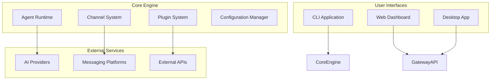

# OpenClaw System Architecture

This section provides comprehensive documentation of OpenClaw's system architecture, covering the overall design, key subsystems, and architectural patterns.

Last updated: 2026-02-03

## Overview

OpenClaw is a unified platform for AI agent orchestration across multiple messaging channels. The architecture is designed around several key principles:

- **Modularity**: Plugin-based extensibility for channels, tools, and services
- **Scalability**: Support for multiple concurrent agents and sessions
- **Flexibility**: Configuration-driven behavior with hot reloading
- **Security**: Isolated plugin runtime and credential management
- **Observability**: Comprehensive logging, monitoring, and diagnostics

## Architecture Documents

### Core Architecture

- [System Architecture](./system-architecture.md)
  - High-level system overview using C4 Model
  - Container and component diagrams
  - Key architectural decisions

- [Plugin Architecture](./plugin-architecture.md)
  - Plugin system design and lifecycle
  - Extension points and registration
  - Runtime isolation and dependency injection

- [Channel and Provider Architecture](./channel-provider-architecture.md)
  - Unified channel interface design
  - Message flow and normalization
  - Provider abstraction and selection

- [Agent Runtime Architecture](./agent-runtime-architecture.md)
  - AI agent orchestration
  - Session lifecycle and context management
  - Tool execution and memory system

- [Data & State Architecture](./data-state-architecture.md)
  - Configuration management and validation
  - State persistence and synchronization
  - Memory system integration

### Specific Subsystems

For specific subsystems, see also:

- [Gateway Architecture](./gateway.md) - Legacy WebSocket gateway documentation
- [Agent Concepts](./agent.md) - Agent-specific concepts
- [Channel Routing](./channel-routing.md) - Message routing design
- [Sessions](./sessions.md) - Session management details
- [Memory](./memory.md) - Memory system documentation
- [Plugins](./plugin-architecture.md) - Plugin system architecture

## System Context

OpenClaw operates as an AI agent platform that bridges multiple messaging channels with AI providers through a unified interface. The system handles:

- Message reception and delivery across platforms
- AI agent execution and context management
- Plugin-based extensibility
- Configuration management and validation
- Real-time monitoring and diagnostics

### Key Components

## Technology Stack

### Core Technologies

- **Runtime**: Node.js 22+ (ESM)
- **Language**: TypeScript
- **Build**: `tsdown` for compilation
- **Testing**: Vitest with V8 coverage
- **Linting**: Oxc (`oxlint`, `oxfmt`)

### Key Libraries

- **CLI**: Commander.js
- **Schema Validation**: Zod
- **HTTP Server**: Hono/Express
- **WebSocket**: ws
- **File Watching**: chokidar

For more details about the gateway architecture specifically, see the [Gateway Architecture](./gateway.md) document.
