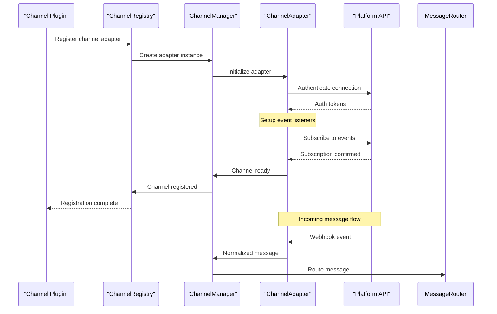
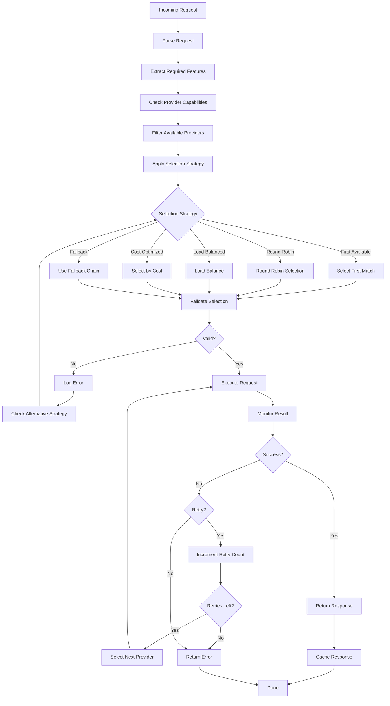
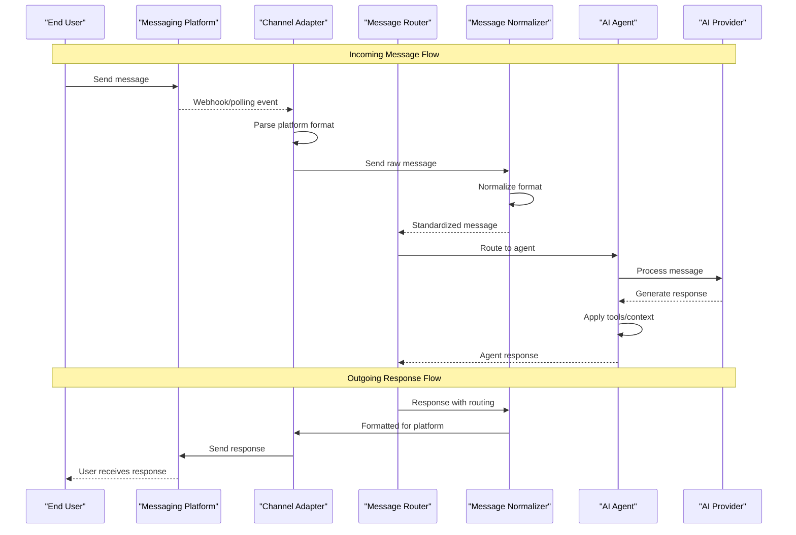

# Channel and Provider Architecture

OpenClaw's channel and provider architecture enables seamless integration with messaging platforms and AI services through a unified adapter pattern.

## Channel Architecture

### Overview

The channel system provides a unified interface for different messaging platforms, handling message normalization, routing, and platform-specific implementations.

```mermaid
graph TB
    subgraph "Unified Interface Layer"
        ChannelInterface["Channel Interface<br/>Abstract Base Class"]
        MessageNormalizer["Message Normalizer<br/>Format Standardization"]
        ChannelRegistry["Channel Registry<br/>Manager & Discovery"]
    end

    subgraph "Channel Adapters"
        WhatsAppChannel["WhatsAppAdapter<br/>Baileys Implementation"]
        TelegramChannel["TelegramAdapter<br/>Bot API"]
        DiscordChannel["DiscordAdapter<br/>Gateway API"]
        SignalChannel["SignalAdapter<br/>signal-cli"]
        iMessageChannel["iMessageAdapter<br/>AppleScript"]
        SlackChannel["SlackAdapter<br/>Web API"]
        GoogleChatChannel["GoogleChatAdapter"]
        LinemeChannel["LINE Adapter"]
        FeishuChannel["Feishu Adapter"]
        MatrixChannel["Matrix Adapter"]
    end

    subgraph "Extension Channels"
        TeamsChannel["Microsoft Teams<br/>Extensions"]
        ZaloChannel["Zalo<br/>Extensions"]
        NostrChannel["Nostr<br/>Extensions"]
        OtherExtensions["Platform Extensions<br/>33+ Plugins"]
    end

    subgraph "Core Components"
        ChannelManager["Channel Manager<br/>Dock & Lifecycle"]
        MessageRouter["Message Router<br/>Routing Logic"]
        ChannelInterface -.->|Implements| WhatsAppChannel
        ChannelInterface -.->|Implements| TelegramChannel
        ChannelInterface -.->|Implements| DiscordChannel
        ChannelInterface -.->|Implements| SignalChannel
        ChannelInterface -.->|Implements| iMessageChannel
        ChannelInterface -.->|Implements| SlackChannel
        ChannelInterface -.->|Implements| GoogleChatChannel
        ChannelInterface -.->|Implements| LinemeChannel
        ChannelInterface -.->|Implements| FeishuChannel
        ChannelInterface -.->|Implements| MatrixChannel

        ChannelInterface -.->|Extends| TeamsChannel
        ChannelInterface -.->|Extends| ZaloChannel
        ChannelInterface -.->|Extends| NostrChannel
        ChannelInterface -.->|Extends| OtherExtensions

        ChannelManager -->|Manages| ChannelInterface
        ChannelManager -->|Uses| MessageNormalizer
        ChannelManager -->|Maintains| ChannelRegistry
        MessageRouter -->|Routes to| ChannelInterface

    ChannelInterface -->|Implements| TeamsChannel
    ChannelInterface -->|Implements| ZaloChannel
    ChannelInterface -->|Implements| NostrChannel
    ChannelInterface -->|Implements| OtherExtensions

    end

    subgraph "External Systems"
        WhatsAppAPI["WhatsApp Web"]
        TelegramAPI["Telegram Bot API"]
        DiscordAPI["Discord Gateway"]
        SignalCLI["signal-cli Process"]
        iMessageAPI["iMessage Framework"]
        SlackAPI["Slack Web API"]
        GoogleAPI["Google Workspace APIs"]
        LineAPI["LINE Messaging API"]
        FeishuAPI["Feishu Open APIs"]
        MatrixAPI["Matrix Client-Server API"]
    end

    %% Connections
    ChannelManager -->|Coordinating| MessageRouter
    MessageRouter -->|Normalizes| MessageNormalizer

    WhatsAppChannel -->|Implements Bridge| WhatsAppAPI
    TelegramChannel -->|Implements Bridge| TelegramAPI
    DiscordChannel -->|Implements Bridge| DiscordAPI
    SignalChannel -->|Implements Bridge| SignalCLI
    iMessageChannel -->|Implements Bridge| iMessageAPI
    SlackChannel -->|Implements Bridge| SlackAPI
    GoogleChatChannel -->|Implements Bridge| GoogleAPI
    LinemeChannel -->|Implements Bridge| LineAPI
    FeishuChannel -->|Implements Bridge| FeishuAPI
    MatrixChannel -->|Implements Bridge| MatrixAPI

    %% Styling
    classDef interface fill:#ffffff,stroke:#4da6ff,stroke-width:3px
    classDef adapter fill:#e6f7ff,stroke:#0099ff,stroke-width:2px
    classDef extension fill:#f0f8ff,stroke:#6699ff,stroke-width:1px
    classDef external fill:#f0f0f0,stroke:#999999,stroke-width:1px
    classDef manager fill:#ffe6f2,stroke:#ff4da6,stroke-width:2px

    class ChannelInterface,MessageNormalizer,ChannelRegistry interface
    class WhatsAppChannel,TelegramChannel,DiscordChannel,SignalChannel,iMessageChannel,SlackChannel,GoogleChatChannel,LinemeChannel,FeishuChannel,MatrixChannel adapter
    class TeamsChannel,ZaloChannel,NostrChannel,OtherExtensions extension
    class WhatsAppAPI,TelegramAPI,DiscordAPI,SignalCLI,iMessageAPI,SlackAPI,GoogleAPI,LineAPI,FeishuAPI,MatrixAPI external
    class ChannelManager,MessageRouter manager
```



### Channel Interface

All channels implement a common interface:

```typescript
interface ChannelAdapter {
  // Identification
  id: string
  name: string
  platform: string

  // Connection Management
  async connect(): Promise<void>
  async disconnect(): Promise<void>
  getStatus(): ChannelStatus

  // Message Operations
  async sendMessage(channelId: string, message: Message): Promise<MessageId>
  async fetchMessages(channelId: string, options: FetchOptions): Promise<Message[]>

  // Event Handling
  onMessage(callback: (message: Message) => void): void
  onConnectionChange(callback: (status: ConnectionStatus) => void): void

  // Channel Management
  async createChannel(name: string, metadata: any): Promise<ChannelInfo>
  async deleteChannel(channelId: string): Promise<void>
  async listChannels(): Promise<ChannelInfo[]>
}
```

### Message Normalization

The normalizer converts platform-specific messages to a unified format:

```typescript
interface NormalizedMessage {
  // Core Fields
  id: string
  timestamp: Date
  content: {
    type: 'text' | 'image' | 'audio' | 'video' | 'file' | 'location'
    text?: string
    media?: MediaReference
    file?: FileReference
  }

  // Sender Info
  sender: {
    id: string
    name?: string
    username?: string
    avatar?: string
  }

  // Channel Context
  channel: {
    id: string
    type: 'dm' | 'group' | 'channel' | 'broadcast'
    name?: string
    participants?: string[]
  }

  // Metadata
  platform: string
  raw: any // Original platform message
  replyContext?: ReplyContext
  forwardContext?: ForwardContext
}
```

### Channel Registration



## Provider Architecture

### Overview

Providers abstract AI, cloud, and service integrations with unified interfaces.

```mermaid
graph TB
    subgraph "Provider Interface Layer"
        ProviderInterface["Provider Interface<br/>Abstract Base"]
        CapabilityManager["Capability Manager<br/>Feature Detection"]
        ProviderRegistry["Provider Registry<br/>Discovery & Management"]
        CredentialManager["Credential Manager<br/>Auth & Rotation"]
    end

    subgraph "AI Providers"
        OAIProvider["OpenAI Provider<br/>GPT Models"]
        ClaudeProvider["Anthropic Provider<br/>Claude Models"]
        GeminiProvider["Google Provider<br/>Gemini Models"]
        GroqProvider["Groq Provider<br/>Fast Inference"]
        BedrockProvider["AWS Bedrock<br/>Multi-Model"]
        AzureProvider["Azure OpenAI"]
        OllamaProvider["Ollama<br/>Local Models"]
    end

    subgraph "Service Providers"
        SpotifyProvider["Spotify Provider"]
        NotionProvider["Notion Provider"]
        OnePasswordProvider["1Password Provider"]
        GitHubProvider["GitHub Provider"]
        SearchProvider["Web Search Provider"]
        ImageGenProvider["Image Generation<br/>DALL-E, SD, etc."]
        EmailProvider["Email Provider"]
        CalendarProvider["Calendar Provider"]
    end

    subgraph "Feature Detection"
        CapabilityList["Capabilities List"]
        ModelInfo["Model Information"]
        RateLimiting["Rate Limit Info"]
        CostTracking["Cost Tracking"]
    end

    subgraph "Selection Logic"
        Selector["Provider Selector"]
        Fallback["Fallback Logic"]
        LoadBalancer["Load Balancer"]
        Router["Request Router"]
    end

    %% Relationships
    ProviderInterface -.->|Implements| OAIProvider
    ProviderInterface -.->|Implements| ClaudeProvider
    ProviderInterface -.->|Implements| GeminiProvider
    ProviderInterface -.->|Implements| GroqProvider
    ProviderInterface -.->|Implements| BedrockProvider
    ProviderInterface -.->|Implements| AzureProvider
    ProviderInterface -.->|Implements| OllamaProvider

    ProviderInterface -.->|Implements| SpotifyProvider
    ProviderInterface -.->|Implements| NotionProvider
    ProviderInterface -.->|Implements| OnePasswordProvider
    ProviderInterface -.->|Implements| GitHubProvider
    ProviderInterface -.->|Implements| SearchProvider
    ProviderInterface -.->|Implements| ImageGenProvider
    ProviderInterface -.->|Implements| EmailProvider
    ProviderInterface -.->|Implements| CalendarProvider

    ProviderInterface -->|Exposes| CapabilityManager
    ProviderInterface -->|Registers with| ProviderRegistry
    ProviderInterface ->|Uses| CredentialManager

    CapabilityManager -->|Provides| CapabilityList
    CapabilityManager -->|Provides| ModelInfo
    CapabilityManager -->|Provides| RateLimiting
    CapabilityManager -->|Provides| CostTracking

    ProviderRegistry -->|Queryable by| Selector
    Selector -->|Uses| CapabilityList
    Selector -->|Uses| ModelInfo

    Selector -->|Routes to| Router
    Router -->|Applies| Fallback
    Router -->|Applies| LoadBalancer

    Router -->|Sends requests| OAIProvider
    Router -->|Sends requests| ClaudeProvider
    Router -->|Sends requests| GeminiProvider
    Router -->|Sends requests| GroqProvider
    Router -->|Sends requests| BedrockProvider

    %% Styling
    classDef interface fill:#ffffff,stroke:#4da6ff,stroke-width:3px
    classDef ai fill:#e6f7ff,stroke:#0099ff,stroke-width:2px
    classDef service fill:#f0f8ff,stroke:#6699ff,stroke-width:1px
    classDef capability fill:#fff2e6,stroke:#ff9933,stroke-width:1px
    classDef selection fill:#ffe6f2,stroke:#ff4da6,stroke-width:2px

    class ProviderInterface,ProviderRegistry,CredentialManager interface
    class OAIProvider,ClaudeProvider,GeminiProvider,GroqProvider,BedrockProvider,AzureProvider,OllamaProvider ai
    class SpotifyProvider,NotionProvider,OnePasswordProvider,GitHubProvider,SearchProvider,ImageGenProvider,EmailProvider,CalendarProvider service
    class CapabilityList,ModelInfo,RateLimiting,CostTracking capability
    class Selector,Router,Fallback,LoadBalancer selection
    CapabilityManager interface
```

### Provider Interface

```typescript
interface ProviderAdapter<T extends ProviderType> {
  // Identification
  id: string
  name: string
  type: T

  // Authentication
  async authenticate(credentials: Credentials): Promise<void>
  async refreshCredentials(): Promise<void>

  // Capability Discovery
  getCapabilities(): ProviderCapability[]
  getModels(): ModelInfo[]
  supportsFeature(feature: string): boolean

  // Request Processing
  async processRequest(request: ProviderRequest): Promise<ProviderResponse>
  async streamRequest(request: ProviderRequest): AsyncGenerator<ProviderResponse>

  // Health & Monitoring
  getHealth(): ProviderHealth
  getUsageStats(): UsageStats
}
```

### Provider Selection Flow



## Message Flow Through the System

### End-to-End Message Processing



## Key Features

### 1. Multi-Platform Support
- Unified message format across all platforms
- Platform-specific feature detection
- Graceful degradation for unsupported features

### 2. Provider Abstraction
- Provider selection based on:
  - Required capabilities
  - Cost optimization
  - Rate limiting
  - Performance
- Automatic fallback chains
- Load balancing across providers

### 3. Extensibility
- Plugin-based channel additions
- Dynamic provider registration
- Custom provider implementation

### 4. Resilience
- Connection monitoring
- Automatic reconnection
- Message queuing for offline periods
- Comprehensive error handling

## Best Practices

1. **Channel Implementation**
   - Handle all platform events (messages, connection changes, errors)
   - Implement proper message status tracking
   - Support pagination for message history
   - Handle rate limits gracefully

2. **Provider Selection**
   - Define fallback chains for critical requests
   - Monitor provider health and costs
   - Implement request caching where appropriate
   - Use streaming for long responses

3. **Message Handling**
   - Validate all incoming messages
   - Sanitize content when needed
   - Handle media uploads/downloads
   - Support message threading where available

## Related Documentation

- [System Architecture](./system-architecture.md) - High-level system overview
- [Plugin Architecture](./plugin-architecture.md) - Extensibility mechanisms
- [Agent Runtime Architecture](./agent-runtime-architecture.md) - AI agent orchestration
- [Channels Documentation](../channels/) - Channel-specific guides

## Source Code References

| Component | File |
|-----------|------|
| Channel Interface | `src/channels/plugins/types.ts` |
| Channel Manager | `src/channels/dock.ts` |
| Message Router | `src/channels/router.ts` |
| Provider Interface | `src/providers/adapter.ts` |
| Provider Registry | `src/providers/registry.ts` |
| Credential Manager | `src/providers/credentials.ts` |
| WhatsApp Adapter | `src/channels/plugins/implementations/whatsapp.ts` |
| Telegram Adapter | `src/channels/plugins/implementations/telegram.ts` |
