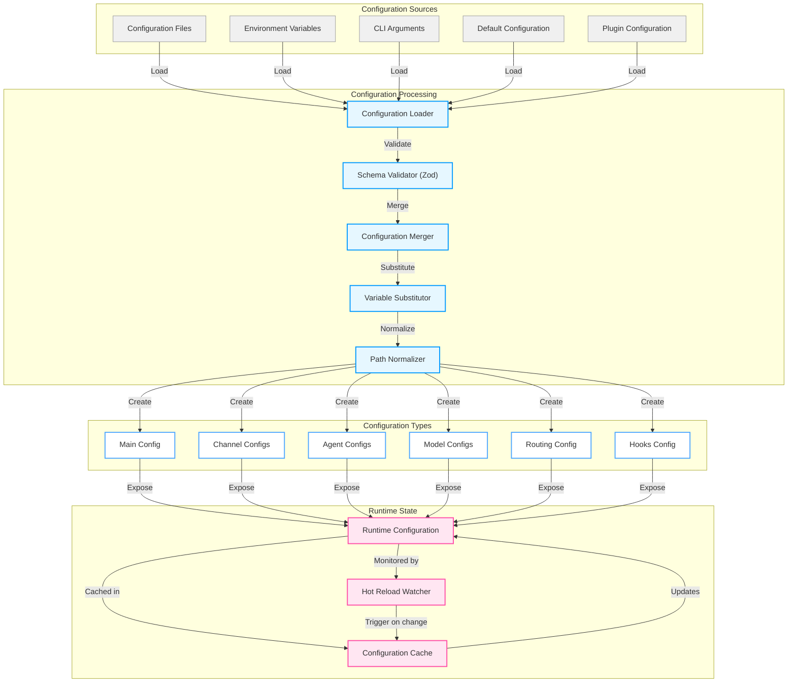
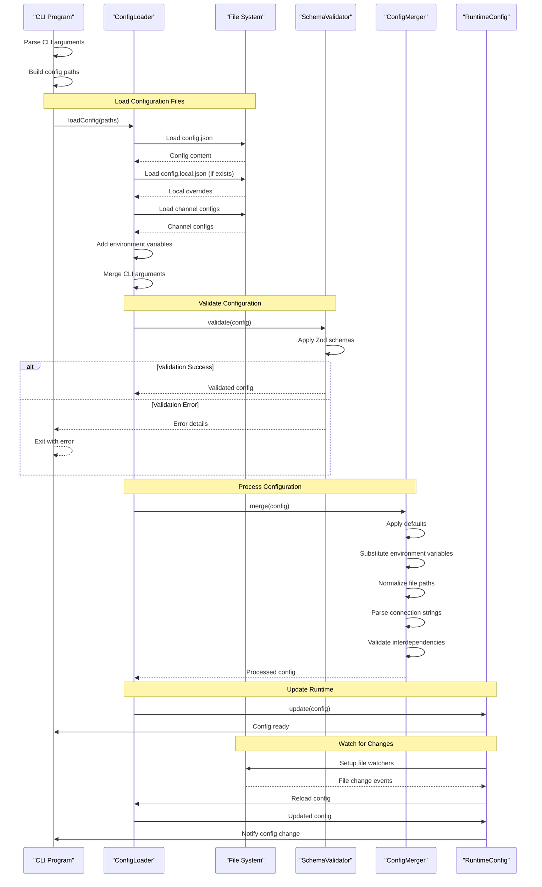
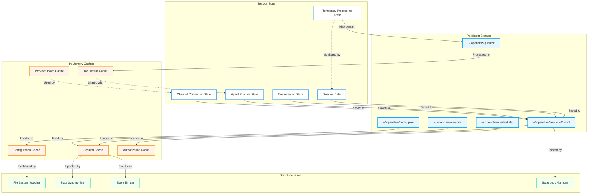
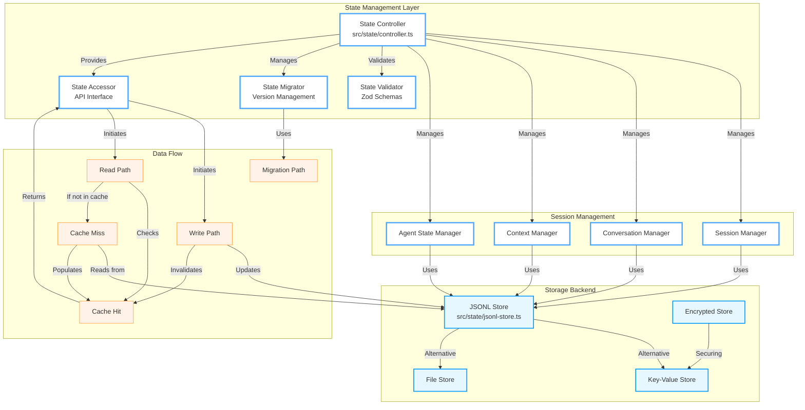

# Data & State Architecture

OpenClaw's state management system provides comprehensive handling of configuration, session state, and memory across all components. This document details the data flow, storage patterns, and state synchronization mechanisms.

## Configuration Flow

### Configuration Management Overview



### Configuration Loading Sequence



### Configuration Schema Structure

```typescript
interface OpenClawConfig {
  // Global Settings
  logLevel: 'trace' | 'debug' | 'info' | 'warn' | 'error'
  timezone: string
  locale: string

  // Gateway Configuration
  gateway: {
    enabled: boolean
    mode: 'local' | 'remote'
    host: string
    port: number
    auth: {
      secret: string
      timeout: number
    }
  }

  // Agent Configuration
  agents: AgentConfig[]

  // Channel Configuration
  channels: {
    [key: string]: ChannelConfig
  }

  // Model Configuration
  models: {
    [key: string]: ModelConfig
  }

  // Routing Configuration
  routing?: RoutingConfig

  // Hook Configuration
  hooks?: {
    [key: string]: HookConfig[]
  }

  // Auto-reply Configuration
  autoReply?: AutoReplyConfig

  // Advanced Configuration
  plugins?: PluginConfig[]
  profiles?: ProfileConfig[]
}
```

## State Management

### State Components



### State Management Component Diagram



## Data Persistence Patterns

### JSONL Session Storage

```typescript
// Example: Session data stored as NDJSON
interface SessionRecord {
  sessionId: string
  agentId: string
  channelId: string
  timestamp: Date
  type: 'message' | 'response' | 'tool' | 'error' | 'state'
  data: any
}

// Storage pattern:
// ~/.openclaw/sessions/{sessionId}.jsonl
// {"sessionId": "abc123", "type": "message", "data": {...}}
// {"sessionId": "abc123", "type": "response", "data": {...}}
// {"sessionId": "abc123", "type": "tool", "data": {...}}
```

### Memory System Architecture

```mermaid
graph TB
    subgraph "Memory System Components"
        MemoryManager["Memory Manager"
        SemanticMemory["Semantic Memory"
            EpisodicMemory["Episodic Memory"
                WorkingMemory["Working Memory"
                    ConsolidationEngine["Consolidation Engine"
                        VectorIndex["Vector Index"
                            SearchEngine["Semantic Search"

    MemoryManager -->|Manages| SemanticMemory
    MemoryManager -->|Manages| EpisodicMemory
    MemoryManager -->|Manages| WorkingMemory

    WorkingMemory -->|Periodically| ConsolidationEngine
    ConsolidationEngine -->|Creates| EpisodicMemory
    EpisodicMemory -->|Enhances| SemanticMemory

    SemanticMemory -->|Indexed in| VectorIndex
    EpisodicMemory -->|Indexed in| VectorIndex

    VectorIndex -->|Enables| SearchEngine
    SearchEngine -->|Retrieves| MemoryManager

    subgraph "Memory Operations"
        Encode["Encode Experience"]
        Store["Store in Memory"]
        Retrieve["Retrieve Relevant"]
        Consolidate["Consolidate Memories"]
        Forget["Forget Old/Unimportant"]
    end

    MemoryManager -->|Performs| Encode
    Encode -->|Results in| Store
    Store -->|Read by| Retrieve
    Retrieve -->|May trigger| Consolidate
    Consolidate -->|May trigger| Forget

    classDef memory fill:#ffffff,stroke:#4da6ff,stroke-width:2px
    classDef operation fill:#e6f7ff,stroke:#0099ff,stroke-width:2px

    class MemoryManager,SemanticMemory,EpisodicMemory,WorkingMemory,ConsolidationEngine,VectorIndex,SearchEngine memory
    class Encode,Store,Retrieve,Consolidate,Forget operation
}
```

## Key Features

### 1. Hot Configuration Reload
- File watchers on configuration files
- Immediate update of runtime configuration
- Partial reconfiguration (only changed values)
- Validation before applying changes

### 2. State Consistency
- Atomic state updates with locks
- Version management for migrations
- Rollback capability for failed updates
- Event-driven state change notifications

### 3. High Performance
- In-memory caching for frequently accessed data
- Lazy loading of session data
- Batched writes to reduce I/O
- Optimistic updates with eventual consistency

### 4. Security & Privacy
- Encrypted storage for sensitive data
- Credential rotation support
- Secure credential vault
- Temporary state cleanup

## Best Practices

### Configuration Management
1. Use environment variables for secrets
2. Keep configuration files under version control (except secrets)
3. Validate configuration at startup
4. Use profiles for different environments

### State Management
1. Minimize state size with pruning
2. Use appropriate cache TTLs
3. Implement graceful degradation when state is unavailable
4. Monitor state growth and performance

### Session Handling
1. Clean up old sessions regularly
2. Implement session timeouts
3. Archive inactive sessions
4. Use separate sessions for isolation

## Related Documentation

- [System Architecture](./system-architecture.md) - High-level system overview
- [Agent Runtime Architecture](./agent-runtime-architecture.md) - AI agent orchestration
- [Configuration Guide](../configuration/) - Configuration file documentation
- [State Management API](../api/state.md) - State management API reference

## Source Code References

| Component | File |
|-----------|------|
| Configuration Loading | `src/config/config.ts` |
| Configuration Schemas | `src/config/zod-schema.config.ts` |
| State Controller | `src/state/controller.ts` |
| Session Manager | `src/state/session-manager.ts` |
| JSONL Store | `src/state/jsonl-store.ts` |
| Memory System | `src/agents/memory.ts` |
| Context Management | `src/agents/context.ts` |
