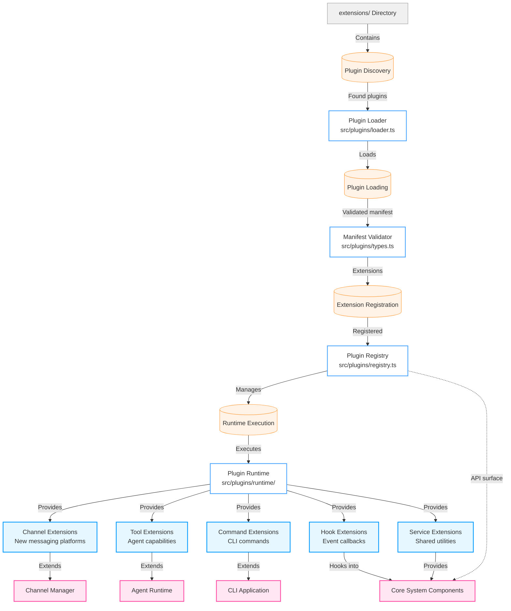
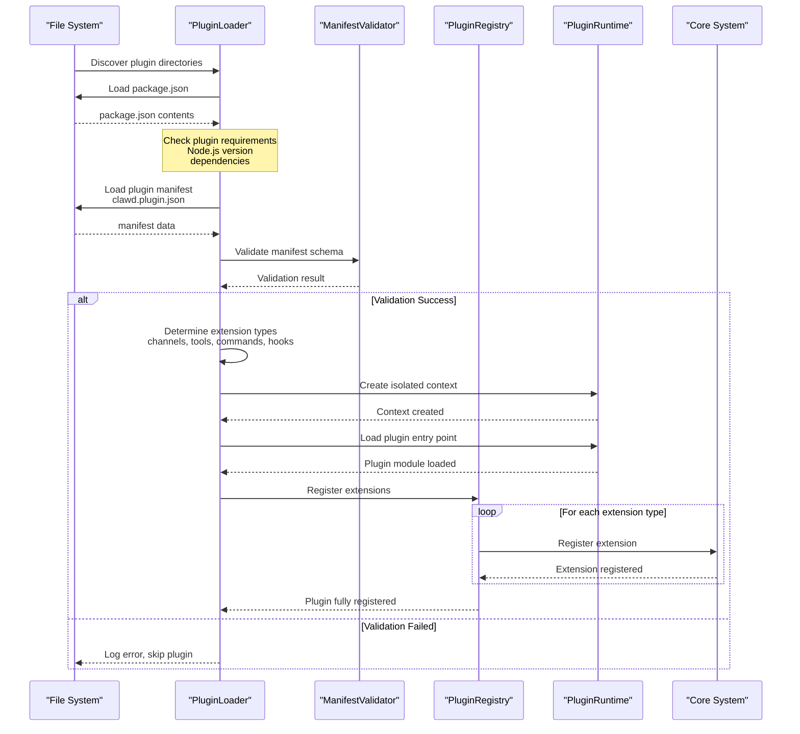
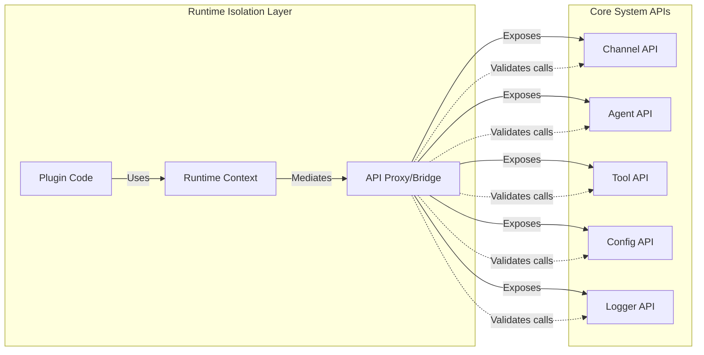

# Plugin Architecture

OpenClaw's plugin system enables extensibility without modifying the core codebase. This document details the plugin architecture, lifecycle, and extension mechanisms.

## Overview

The plugin system provides:
- **Dynamic Loading**: Plugins are discovered and loaded at runtime
- **Runtime Isolation**: Plugins run in isolated contexts with controlled APIs
- **Extensibility**: Multiple extension points (channels, tools, commands, hooks, services)
- **Dependency Management**: Automatic dependency resolution within plugins

## Plugin System Components



## Plugin Lifecycle

### Plugin Registration Sequence



### Plugin Runtime Dependency Injection



## Extension Points

### 1. Channel Extensions

Add support for new messaging platforms.

```typescript
// Example: MyChannel extension
export default {
  name: 'mychannel',
  version: '1.0.0',
  channels: [{
    name: 'mychannel',
    // Channel implementation
    async sendMessage(channelId, message) {
      // Implementation
    },
    async start() {
      // Connection logic
    }
  }]
}
```

**Registration Flow:**
```
Plugin Discovery -> Manifest Parsing -> Channel Registration ->
Runtime Setup -> Channel Initialization -> Message Routing Integration
```

### 2. Tool Extensions

Add new capabilities to AI agents.

```typescript
// Example: Custom Tool
export default {
  name: 'mytool',
  version: '1.0.0',
  tools: [{
    name: 'my_custom_tool',
    description: 'Does something useful',
    parameters: z.object({
      input: z.string()
    }),
    handler: async (args) => {
      // Tool implementation
      return { result: 'success' };
    }
  }]
}
```

**Registration Flow:**
```
Plugin Discovery -> Manifest Parsing -> Tool Registration ->
Agent Runtime Integration -> Capability Registration -> Execution Context Setup
```

### 3. Command Extensions

Add new CLI commands.

```typescript
// Example: Custom Command
export default {
  name: 'mycommand',
  version: '1.0.0',
  commands: [{
    name: 'my-custom-command',
    description: 'My custom functionality',
    handler: async (args) => {
      // Command implementation
    }
  }]
}
```

### 4. Hook Extensions

Add event-driven functionality.

```typescript
// Example: Custom Hooks
export default {
  name: 'myhooks',
  version: '1.0.0',
  hooks: {
    'message:received': async (message) => {
      // Pre-process message
    },
    'agent:response': async (response) => {
      // Post-process response
    }
  }
}
```

### 5. Service Extensions

Provide shared utilities.

```typescript
// Example: Shared Service
export default {
  name: 'myservice',
  version: '1.0.0',
  services: {
    myUtility: {
      helperFunction: () => { /* ... */ }
    }
  }
}
```

## Plugin Manifest Structure

Each plugin requires a `clawd.plugin.json` manifest:

```json
{
  "name": "my-plugin",
  "version": "1.0.0",
  "main": "./dist/index.js",
  "extensions": {
    "channels": ["./channels/*.js"],
    "tools": ["./tools/*.js"],
    "commands": ["./commands/*.js"],
    "hooks": ["./hooks/*.js"]
  },
  "dependencies": {
    "@openclaw/plugin-sdk": "^3.0.0"
  },
  "engines": {
    "node": ">=22.0.0"
  }
}
```

## Runtime Isolation

Plugins run in isolated contexts with:
- **Limited API Surface**: Only documented APIs are exposed
- **Permission Checking**: All operations are validated
- **Error Boundaries**: Plugin errors don't crash the core system
- **Resource Limits**: CPU and memory usage can be capped

## Plugin Development Workflow

1. **Setup**: Create plugin directory with `package.json`
2. **Manifest**: Define `clawd.plugin.json` with extensions
3. **Implementation**: Build extension code following SDK patterns
4. **Testing**: Test with `openclaw plugin test`
5. **Distribution**: Publish to npm or distribute as package

## Extension Registry

The plugin registry maintains:
- **Active Plugins**: Currently loaded plugins
- **Extension Mappings**: What each plugin provides
- **API Bindings**: Runtime API access control
- **Dependency Graph**: Inter-plugin dependencies
- **Lifecycle State**: Loading, active, error states

## Best Practices

1. **Minimal Dependencies**: Keep plugin dependencies lightweight
2. **Error Handling**: Always handle errors gracefully
3. **Type Safety**: Use TypeScript and proper types
4. **Documentation**: Document all extensions clearly
5. **Testing**: Include comprehensive tests
6. **Isolation**: Don't depend on internal APIs
7. **Versioning**: Follow semantic versioning

## Security Considerations

- **Code Review**: All plugins should be reviewed
- **Signature Verification**: Consider plugin signing
- **Sandbox Limitations**: Runtime isolation is not foolproof
- **API Auditing**: Log all plugin API calls
- **Permission Model**: Plugins request specific permissions

## Related Documentation

- [System Architecture](./system-architecture.md) - High-level system overview
- [Channel Provider Architecture](./channel-provider-architecture.md) - Messaging integrations
- [Plugin SDK Documentation](../channels/plugins.md) - Building plugins
- [Source Code](../src/plugins/) - Plugin system implementation

## Source Code References

| Component | File |
|-----------|------|
| Plugin Registry | `src/plugins/registry.ts` |
| Plugin Loader | `src/plugins/loader.ts` |
| Manifest Types | `src/plugins/types.ts` |
| Runtime Context | `src/plugins/runtime/context.ts` |
| SDK Interface | `src/plugin-sdk/index.ts` |
