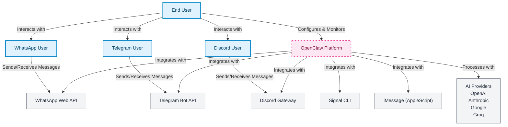

# System Architecture

OpenClaw is a unified platform for AI agent orchestration across multiple messaging channels. This document provides a high-level overview of the system architecture using the C4 Model.

## System Context

The System Context diagram shows OpenClaw as a black box and the interactions with external actors and systems.



**Key Interactions:**
- **End Users** configure and monitor OpenClaw through the CLI or Gateway UI
- **Messaging Users** interact with OpenClaw through various platforms
- **Messaging APIs** provide the actual messaging capabilities
- **AI Providers** handle the language model processing for agents

## Container Diagram

The Container diagram shows the high-level technical building blocks of OpenClaw.

```mermaid
graph TB
    %% External Actors
    User["End User"]

    %% Containers
    CLI["CLI Application<br/>Command-line interface<br/>src/cli/"]
    Gateway["Gateway Server<br/>WebSocket & HTTP API<br/>src/gateway/"]
    WebUI["Web Dashboard<br/>React-based UI<br/>src/canvas-host/"]

    PluginRuntime["Plugin Runtime<br/>Extension engine<br/>src/plugins/"]
    AgentManager["Agent Manager<br/>AI agent orchestration<br/>src/agents/"]
    ChannelManager["Channel Manager<br/>Messaging integration<br/>src/channels/"]
    ConfigManager["Configuration Manager<br/>Settings & validation<br/>src/config/"]

    ExternalDB["~/.openclaw/<br/>Sessions, Config, Queues"]
    Binaries["External Binaries<br/>ffmpeg, signal-cli"]

    %% External Systems
    MessagingAPIs["Messaging APIs<br/>WhatsApp, Telegram<br/>Discord, Signal, etc."]
    AIProviders["AI Providers<br/>OpenAI, Claude<br/>Gemini, Groq"]

    %% Relationships
    User -->|Commands| CLI
    User -->|Browser| Gateway
    User -->|Browser| WebUI

    CLI -->|Config API| ConfigManager
    CLI -->|Agent API| AgentManager
    CLI -->|Channel API| ChannelManager

    Gateway -->|WebSocket| AgentManager
    Gateway -->|HTTP API| ConfigManager
    Gateway -->|Plugin API| PluginRuntime

    PluginRuntime -->|Manages| ChannelManager
    PluginRuntime -->|Manages| AgentManager

    AgentManager -->|Routes messages| ChannelManager
    ChannelManager -->|Send/Receive| MessagingAPIs
    AgentManager -->|AI Processing| AIProviders

    AgentManager -->|Store/Load| ExternalDB
    ConfigManager -->|Read/Write| ExternalDB
    ChannelManager -->|Store/Load| ExternalDB

    ChannelManager -->|External tools| Binaries

    %% Styling - Dark/Light mode compatible
    classDef container fill:#e0f2fe,stroke:#0284c7,stroke-width:2px,color:#0c4a6e
    classDef database fill:#ecfdf5,stroke:#059669,stroke-width:2px,color:#064e3b
    classDef external fill:#f3f4f6,stroke:#6b7280,stroke-width:1px,color:#1f2937
    classDef ui fill:#fce7f3,stroke:#ec4899,stroke-width:2px,color:#831843

    class CLI,Gateway,PluginRuntime,AgentManager,ChannelManager,ConfigManager container
    class ExternalDB database
    class MessagingAPIs,AIProviders external
    class WebUI ui
    User ui
```

**Container Responsibilities:**

| Container | Technology | Key Responsibilities |
|-----------|------------|---------------------|
| **CLI Application** | Node.js/TypeScript | Command execution, config management, monitoring |
| **Gateway Server** | WebSocket/HTTP | REST API, WebSocket server, device pairing |
| **Web Dashboard** | React/A2UI | Browser-based management interface |
| **Plugin Runtime** | Runtime Contexts | Plugin loading, isolation, API management |
| **Agent Manager** | Pi AI Runtime | Session management, tool execution, context |
| **Channel Manager** | Adapters | Platform integration, message normalization |
| **Config Manager** | Zod/Schema | Validation, defaults, environment handling |

## Component Relationships

The core system follows a hub-and-spoke architecture where the Plugin Runtime acts as the central coordinator:

1. **CLI** and **Gateway** provide user interfaces
2. **Plugin Runtime** manages extensions and coordinates between systems
3. **Channel Manager** handles all messaging platform integrations
4. **Agent Manager** orchestrates AI agent execution
5. **Config Manager** provides centralized configuration

Key integration points:
- **Plugin System**: Extends functionality without core changes
- **Gateway API**: Unified interface for all operations
- **Message Routing**: Channels → Agents → Channels
- **Data Storage**: Local files for configuration and session state

## Data Flow

### Message Flow
```
User Message → Channel Adapter → Message Router → Agent Session
                                                      ↓
Response ← Channel Adapter ← Message Router ← Agent Response
```

### Configuration Flow
```
Config Files → Validation (Zod) → Runtime Config → All Components
                ↓
          Environment Vars → Substitution → Merged Config
```

### Plugin Flow
```
Plugin Discovery → Manifest Loading → Extension Registration → Runtime Setup
                                                                      ↓
                                                            API Exposure
```

## Key Architectural Decisions

1. **Plugin Architecture**: Extensible design allows channels, tools, and features to be added without core changes
2. **Adapter Pattern**: Unified interfaces for messaging platforms enable new integrations
3. **Dependency Injection**: Controlled API surface through `createDefaultDeps()` pattern
4. **Configuration-First**: Schema-based validation ensures type safety and correctness
5. **Local-First Storage**: Filesystem-based storage for privacy and portability

## Technical Standards

- **TypeScript**: Full type safety throughout the codebase
- **ES Modules**: Native ES modules with `tsdown` compilation
- **Node.js 22+**: Modern JavaScript features
- **Vitest**: Testing framework with V8 coverage
- **Oxc**: Linting and formatting for consistency

## Related Documentation

- [Plugin Architecture](./plugin-architecture.md) - Detailed plugin system design
- [Channel Provider Architecture](./channel-provider-architecture.md) - Messaging integration patterns
- [Agent Runtime Architecture](./agent-runtime-architecture.md) - AI agent orchestration
- [Data & State Architecture](./data-state-architecture.md) - Configuration and state management

## Source Code References

| Component | Primary Files |
|-----------|---------------|
| CLI | `src/cli/program.ts`, `src/commands/*.ts` |
| Gateway | `src/gateway/server.ts`, `src/gateway/ws.ts` |
| Plugins | `src/plugins/registry.ts`, `src/plugins/loader.ts` |
| Agents | `src/agents/agent.ts`, `src/agents/pi-embedded-runner.ts` |
| Channels | `src/channels/registry.ts`, `src/channels/dock.ts` |
| Config | `src/config/config.ts`, `src/config/zod-schema*.ts` |
